Framing Management
==================

**A framework to manage spatial image manipulations, with a focus on VFX shot deliveries.**

Motivation
----------

Lately we’ve been getting client/DI tech specs, with sections similar to this:

> * **DI pixel aspect ratio:** 1.0
> * **DI frame size:** 4180x2304
> * **Projection area in DI frame:** central 4096x1716
> * **VFX working area in DI frame:** central 4180x1750 or available image if smaller
> * **Editorial frame size:** 1920x1080
> * **Editorial pixel aspect ratio:** 1.0
> * **Projection area in Editorial frame:** 1920x804
>
> VFX will be delivered to vendors in the corresponding camera’s **native resolution** as indicated in the table below. The ‘projection area’ is the region composed for final projection by the cinematographer. A ‘pixel aspect’ that is not 1.0 indicates that an anamorphic lens was used.
>
> VFX submissions should be scaled to the **DI frame** (4180x2304) such that the projection area maps to the central 4096x1716. A guide to the scaling factors required for each camera is shown in the table below.
>
> Camera Format                      | Pixel Aspect | Native Resolution | Projection Area   | Scale to DI frame
> -----------------------------------|:------------:|:-----------------:|:-----------------:|:------------------:
> **Alexa MiniLF OG Ana1.8x ext100** |     1.80     |     4448x3096     | central 4106x3096 | 99.767% x 55.426%
> **Alexa MiniLF OG Ana2x ext100**   |     2.00     |     4448x3096     | central 3695x3096 | 110.853% x 55.426%
> **Alexa MiniLF OG Ana2x ext68**    |     2.00     |     4448x3096     | central 2542x2130 | 161.151% x 80.576%
> **Canon LEGRIA HF R806**           |     1.00     |     1920x1080     | central 1920x804  | 213.333% x 213.333%
> **DJI Zenmuse X7 6k**              |     1.00     |     6016x3200     | central 6016x2520 | 68.085% x 68.085%
>
> With some or all of the camera formats this may require some cropping and/or zero-padding. The vendor is free to determine a scaling methodology (e.g. scale then crop, or vice versa) which is suitable for their software and workflow— rounding to whole or even-numbered pixel values is permitted as part of that process provided the projection area is always covered by active image pixels.
>
> Embedding into the delivery frame should maintain a **common center.**
>
> Where possible, scaling should employ “Lanczos 6” filtering, applied in a log space, in order to match the non-VFX material in the DI.
>
> Hard masking the image to the VFX working area is accepted, but leaving any extra image content in place is preferred.
>
> Editorial media versions of the VFX (submitted to Editorial, not to DI) should be scaled into the **Editorial frame** (1920x1080) such that the projection area maps to the central 1920x804. This can be achieved by scaling the DI frame by 46.875% then embedding centrally into the HD frame.

The table above is very reduced compared to real shows. As you can see, it’s a complex mixture of resolutions and pixel aspect ratios, with rather aggressive cropping decisions that they want to preserve. Moreover, some of the formats are either extremely reduced or enlarged to fit the deliverables— several of them are enlarged in one axis and reduced in the other.

Because of all this, we think the VFX shot pipeline could benefit from a system that is:

* A one-stop solution to express all the required resolution and framing data for delivery.
* Capable of determining optimal resolutions, and providing the means to account for those, on every pipeline step.
* Independent from any software package.
* Artist-friendly (or rather, Editor/Supervisor-friendly).

Data model
----------

The framework uses a node-based data model. Taking the tech specs above, this is how it would get represented:

```mermaid
%%{init: {
  'themeCSS': 'h3 {margin: 0} table {border-collapse: collapse; margin: 0.4em 0 0} td {border-top: 1px solid #666; padding: 0.3em 0.6em; text-align: right} td:last-child {text-align: left} i {color: #F60; font-size: 0.8em; font-style: normal; font-weight: bold; vertical-align: super}'
}}%%
flowchart TB
  settings("<h3>Settings</h3><table><tr><td>☑️</td><td>Filtering</td><td>⚪ box
    ⚪ triangle
    ⚪ cubic
    🔵 lanczos
    ⚪ sinc
    ㅤㅤ(…)</td></tr><tr><td>☑️</td><td>Filter size</td><td>6.0</td></tr><tr><td>☑️</td><td>Log space</td><td>☑️</td></tr><tr><td>☑️</td><td>Sharp borders<i>1</i></td><td>☑️</td></tr><tr><td>☑️</td><td>Border threshold<i>1</i></td><td>1.0</td></tr></table>")
  settings --> dot1(( ))
  dot1 --> rules1("<h3>Rules</h3><table><tr><td>☑️</td><td>Width</td><td>4448</td></tr><tr><td>☑️</td><td>Height</td><td>3096</td></tr><tr><td>⬜</td><td>Pixel aspect</td><td></td></tr><tr><td>⬜</td><td>Key</td><td></td></tr></table>")
  dot1 --> rules2("<h3>Rules</h3><table><tr><td>☑️</td><td>Width</td><td>1920</td></tr><tr><td>☑️</td><td>Height</td><td>1080</td></tr><tr><td>☑️</td><td>Pixel aspect</td><td>1.0</td></tr><tr><td>⬜</td><td>Key</td><td></td></tr></table>")
  dot1 --> rules3("<h3>Rules</h3><table><tr><td>☑️</td><td>Width</td><td>6016</td></tr><tr><td>☑️</td><td>Height</td><td>3200</td></tr><tr><td>☑️</td><td>Pixel aspect</td><td>1.0</td></tr><tr><td>⬜</td><td>Key</td><td></td></tr></table>")
  rules1 --> dot2(( ))
  dot2 --> rules4("<h3>Rules</h3><table><tr><td>⬜</td><td>Width</td><td></td></tr><tr><td>⬜</td><td>Height</td><td></td></tr><tr><td>☑️</td><td>Pixel aspect</td><td>1.8</td></tr><tr><td>⬜</td><td>Key</td><td></td></tr></table>")
  dot2 --> rules5("<h3>Rules</h3><table><tr><td>⬜</td><td>Width</td><td></td></tr><tr><td>⬜</td><td>Height</td><td></td></tr><tr><td>☑️</td><td>Pixel aspect</td><td>2.0</td></tr><tr><td>⬜</td><td>Key</td><td></td></tr></table>")
  rules5 --> dot3(( ))
  dot3 --> rules6("<h3>Rules</h3><table><tr><td>⬜️</td><td>Width</td><td></td></tr><tr><td>⬜</td><td>Height</td><td></td></tr><tr><td>⬜</td><td>Pixel aspect</td><td></td></tr><tr><td>☑️</td><td>Key</td><td>ext100</td></tr></table>")
  dot3 --> rules7("<h3>Rules</h3><table><tr><td>⬜️</td><td>Width</td><td></td></tr><tr><td>⬜</td><td>Height</td><td></td></tr><tr><td>⬜</td><td>Pixel aspect</td><td></td></tr><tr><td>☑️</td><td>Key</td><td>ext68</td></tr></table>")
  rules7 --> crop1("<h3>Centre crop</h3><table><tr><td>️☑️</td><td>Width</td><td>2542.0</td></tr><tr><td>☑️</td><td>Height</td><td>2130.0</td></tr><tr><td></td><td>Pixel snap</td><td>☑️</td></tr></table>")
  rules2 -------> dot4(( ))
  rules3 -------> dot4
  rules4 -----> dot4
  rules6 ---> dot4
  crop1 --> dot4
  dot4 --> dot5(( ))
  dot5 --> reformat1("<h3>Reformat</h3><table><tr><td>️☑️</td><td>Width</td><td>4096.0</td></tr><tr><td>☑️</td><td>Height</td><td>1716.0</td></tr><tr><td>☑️</td><td>Pixel aspect</td><td>1.0</td></tr><tr><td></td><td>Method</td><td>⚪ distort
    ⚪ fit
    🔵 overflow</td></tr></tr><tr><td></td><td>Data border snap<i>2</i></td><td>⬜</td></tr></table>")
  dot5 --> reformat2("<h3>Reformat</h3><table><tr><td>️☑️</td><td>Width</td><td>1920.0</td></tr><tr><td>☑️</td><td>Height</td><td>804.0</td></tr><tr><td>☑️</td><td>Pixel aspect</td><td>1.0</td></tr><tr><td></td><td>Method</td><td>⚪ distort
    ⚪ fit
    🔵 overflow</td></tr></tr><tr><td></td><td>Data border snap<i>2</i></td><td>⬜</td></tr></table>")
  reformat1 --> dot6(( ))
  dot6 --> crop2("<h3>Centre crop</h3><table><tr><td>️☑️</td><td>Width</td><td>4180.0</td></tr><tr><td>☑️</td><td>Height</td><td>2304.0</td></tr><tr><td></td><td>Pixel snap</td><td>☑️</td></tr></table>")
  dot6 --> crop3("<h3>Centre crop</h3><table><tr><td>️☑️</td><td>Width</td><td>4180.0</td></tr><tr><td>☑️</td><td>Height</td><td>1750.0</td></tr><tr><td></td><td>Pixel snap</td><td>☑️</td></tr></table>")
  reformat2 ---> crop4("<h3>Centre crop</h3><table><tr><td>️☑️</td><td>Width</td><td>1920.0</td></tr><tr><td>☑️</td><td>Height</td><td>1080.0</td></tr><tr><td></td><td>Pixel snap</td><td>☑️</td></tr></table>")
  crop2 --> output1(<h3>Output</h3><table><tr><td>Key</td><td>delivery</td></tr></table>)
  crop3 --> output2(<h3>Output</h3><table><tr><td>Key</td><td>workarea</td></tr></table>)
  crop4 --> output3(<h3>Output</h3><table><tr><td>Key</td><td>editorial</td></tr></table>)
```

The following rules apply:

* All nodes accept connections **to** them.
* _Output_ is the only node that doesn’t accept connections **from** it.
* Each _Output_ must have a unique _Key._
* Tracing up each _Output_ node’s connections, should yield an unambiguous set of _Rules,_ and values for all _Settings._

Other available nodes are:

```mermaid
%%{init: {
  'themeCSS': 'h3 {margin: 0} table {border-collapse: collapse; margin: 0.4em 0 0} td {border-top: 1px solid #666; padding: 0.3em 0.6em; text-align: right} td:last-child {text-align: left} i {color: #F60; font-size: 0.8em; font-style: normal; font-weight: bold; vertical-align: super}'
}}%%
flowchart TB
  blackoutside(<h3>Black outside</h3>)
  edgestretch("<h3>Edge stretch<i>3</i></h3><table><tr><td>Top edge</td><td>0.0</td></tr><tr><td>Left edge</td><td>0.0</td></tr><tr><td>Right edge</td><td>0.0</td></tr><tr><td>Bottom edge</td><td>0.0</td></tr></table>")
  matrix("<h3>Matrix</h3><table><tr><td>Values</td><td>1.0ㅤ0.0ㅤ0.0
    0.0ㅤ1.0ㅤ0.0
    0.0ㅤ0.0ㅤ1.0</td></tr></table>")
  offset("<h3>Offset/crop</h3><table><tr><td></td><td>Corner</td><td>⚪ TLㅤ⚪ TR
    🔵 BLㅤ⚪ BR</td></tr><tr><td></td><td>Right</td><td>0.0</td></tr><tr><td></td><td>Up</td><td>0.0</td></tr><tr><td>⬜</td><td>Width</td><td>1920.0</td></tr><tr><td>⬜</td><td>Height</td><td>1080.0</td></tr></table>")
  relcrop(<h3>Relative crop</h3><table><tr><td>Top edge</td><td>0.0</td></tr><tr><td>Left edge</td><td>0.0</td></tr><tr><td>Right edge</td><td>0.0</td></tr><tr><td>Bottom edge</td><td>0.0</td></tr></table>)
  roll("<h3>Roll</h3><table><tr><td>Clockwise</td><td>0.0°</td></tr></table>")
  size(<h3>Size</h3><table><tr><td>Width</td><td>100.0%</td></tr><tr><td>Height</td><td>100.0%</td></tr></table>)
```

### Footnotes on graphs above

1. In cases where image borders are part of the result (letterboxing), if such borders fall between pixel edges, the user can decide whether to “premultiply” all channels _(Sharp borders_ off), and if not, how many of those border pixels to preserve _(Border threshold,_ 0.0 discarding all pixels that wouldn’t be opaque if _Sharp borders_ was off, and 1.0 preserving as many as possible).
2. When reformatting an image that has previously been cropped, it might be in the user’s best interest to ensure that the original image borders fall on pixel edges.
3. This node allows the user to “eat out” or recover rows of pixels on each edge separately. This deforms the image ever so slightly, which is desired in this case, as we’ve had to do so before, while trying to match the Editorial offlines.

Processing
----------

Results can be obtained once the _Rules_ an image corresponds to, and the _Output_ the user is requesting, are determined. Every transformation defined in the graph, is always achievable by the following chain of operations in a linear* colour space:

1. (Optimisation) Discard pixels that don’t contribute to the final result.
2. (Depending on _Settings > Log Space)_ Convert to generic* base-2 logarithmic space.
3. Resample the image **once,** based on a 3×3 transformation matrix.
4. (Depending on _Settings > Log Space)_ Convert back to linear* space.
5. Redefine the image bounds (crop it).
6. (Only if borders visible) Multiply every channel by the same mask.

\* When it comes to filtering, colour management is negligible— you can’t really tell if an Alexa Wide Gamut image has been resampled in Log C V3 for example; just that it happened in a logarithmic space.
